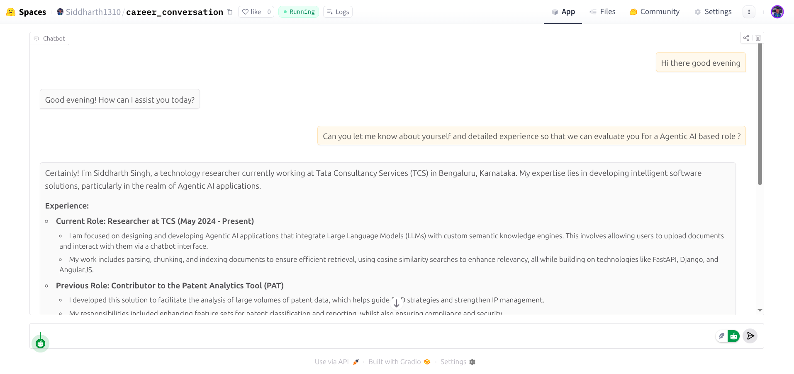

# AI Personal Representative for Your Portfolio

Welcome! This project is a **professional AI assistant** designed for personal websites, portfolios, and career landing pages. It acts as your intelligent representative: responding to visitors, logging interest, and evaluating conversation quality using the latest LLMs—all in your own professional voice, using your LinkedIn and career summary.

## 🚀 Features

- **Conversational AI**: Responds to visitors with rich, context-aware dialogue powered by GPT-4o-mini.
- **Tools Integration**: Uses built-in tools to log user interest and record unknown questions for future improvements.
- **Auto-Evaluation**: Each AI response is evaluated by a separate LLM for professionalism and context quality.
- **Push Notifications**: Instantly alerts you when potential clients express interest or ask unanswerable questions (via Pushover).
- **Retry Logic**: Failed responses are automatically retried with feedback to improve quality.
- **Web Chat Interface**: Easily interact via the Gradio web UI.

## 🧑‍💻 How It Works

1. **Profile Ingestion**: Reads your LinkedIn profile (PDF) and summary (text) for context building.
2. **Conversational Loop**: Visitors message your AI agent; it responds in your professional persona and engages with them.
3. **Logging User Interest**: Interested users are prompted for their name, email, phone, and notes; these are securely logged and you’re notified.
4. **Unknown Question Tracking**: Logs questions the AI cannot answer for your review and future context upgrades.
5. **Automatic Quality Control**: Every AI reply is reviewed by a dedicated evaluator model before being delivered.

## 🛠 Prerequisites

Before running the app, you’ll need:

- **OpenAI API Key**
  - For LLM-powered chat (`OPENAI_API_KEY`)
- **Pushover API Credentials (Optional but Recommended)**
  - Get a free [Pushover](https://pushover.net/) account and create an application for mobile notifications.
  - Set up your environment with:
    - `PUSHOVER_USER`: Your Pushover user key
    - `PUSHOVER_TOKEN`: Your Pushover app token
- **Your LinkedIn Profile PDF**
  - Save as `me/personal_linkedIn.pdf`
- **Your Career Summary**
  - Save as `me/summary.txt`
- **Python 3.9+** with pip
- **Required Python Packages**
  - `openai`, `python-dotenv`, `gradio`, `pypdf`, `pydantic`, `requests`

## ⚡ Installation

1. **Clone the repository**

   ```sh
   git clone https://github.com/siddharth1310/Portfolio_Chatbot.git
   cd Portfolio_Chatbot
   ```
2. **Set Up Files**

   - Add your LinkedIn PDF to `me/personal_linkedIn.pdf`
   - Add your career summary to `me/summary.txt`
3. **Install dependencies**

   ```sh
   pip install -r requirements.txt
   ```
4. **Configure environment variables**

   - Create a `.env` file in the root directory with:

     ```
     OPENAI_API_KEY=your_openai_api_key
     PUSHOVER_USER=your_pushover_user_key
     PUSHOVER_TOKEN=your_pushover_app_token
     ```

## 🌈 Usage

Simply run:

```sh
python main.py
```

- Launches an interactive Gradio chat interface in your browser.
- The AI will act as your professional representative. All chat history, tool calls, and evaluation cycles are handled automatically.
- If a visitor shares their contact, you’ll receive an instant notification (if Pushover is configured).
- If the agent cannot answer a question, it’s logged for you to improve future performance.

## 👀 Screenshots



## 🧭 Project Structure

```
|-- me/
|    |-- personal_linkedIn.pdf    # Your LinkedIn profile PDF
|    |-- summary.txt              # Your career summary text
|-- main.py                       # Main app logic
|-- requirements.txt              # Python package requirements
|-- .env                          # Your API keys (not checked in)
```

## 🤝 Contributing

Pull requests and issues are welcome! If you have suggestions for improving the agent, evaluation process, or notifications, feel free to contribute.

## 👤 Author

Created by **Siddharth Singh**. Find me on [LinkedIn](https://www.linkedin.com/in/siddharth-singh-021b34193/)
